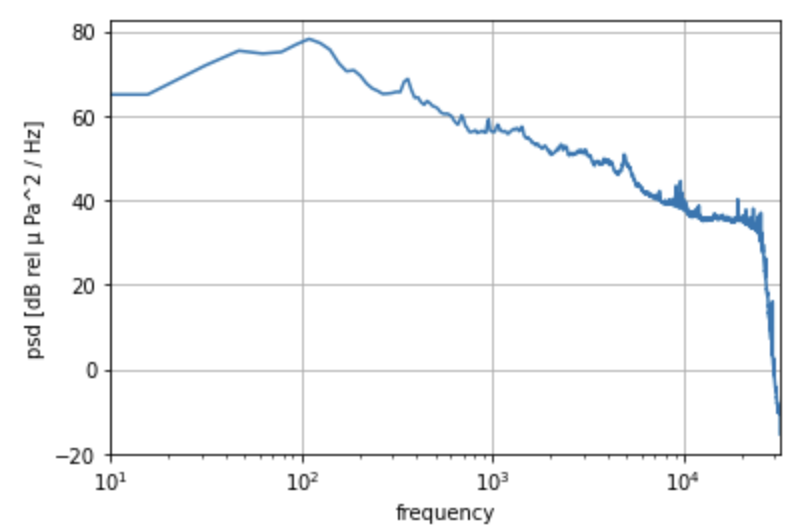
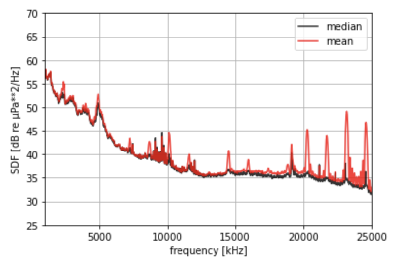
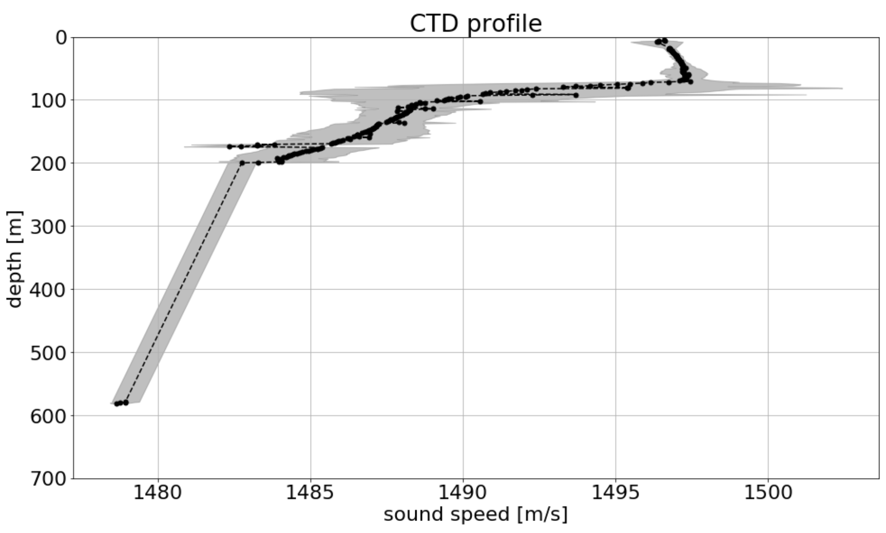

# User Guide

## Installation

you can install ooipy with pip

```console
pip install ooipy
```

If you want to get latest (unreleast) versions, or contribute to development you can clone the repository and install it from the source code.

```console
git clone https://github.com/Ocean-Data-Lab/ooipy.git
cd ooipy
pip install -e .
```
The -e flag allows you to edit the source code and not have to reinstall the package.

The installation has several extras for different development cases ['dev','docs']. These optional dependencies can be installed with `pip install -e .[dev]` or `pip install -e .[docs]`.

## Download Hydrophone Data

How to download data from broadband hydrophones
```python
import ooipy
import datetime
from matplotlib import pyplot as plt

# Specify start time, end time, and node for data download (1 minutes of data)
start_time = datetime.datetime(2017,7,1,0,0,0)
end_time = datetime.datetime(2017,7,1,0,1,0)
node1 = 'LJ01D'

# Download Broadband data
print('Downloading Broadband Data:')
hdata_broadband = ooipy.get_acoustic_data(start_time, end_time, node1, verbose=True)
```

How to download data from low frequency hydrophones
```python
start_time = datetime.datetime(2017,7,1,0,0,0)
end_time = datetime.datetime(2017,7,1,0,1,0)
node='Eastern_Caldera'

# Download low frequency data
print('Downloading Low Frequency Data:')
hdata_lowfreq = ooipy.get_acoustic_data_LF(start_time, end_time, node2, verbose=True, zero_mean=True)
```

The {py:func}`ooipy.hydrophone.basic.HydrophoneData` object has all of the functionality of the {py:class}`obspy.core.trace.Trace`, which includes plotting, resampling, filtering and more. See obspy documentation for more information.

### Hydrophone nodes

**Broadband Hydrophones**
* [Oregon Shelf Base Seafloor (Fs = 64 kHz)](https://ooinet.oceanobservatories.org/data_access/?search=CE02SHBP-LJ01D-11-HYDBBA106)
    * 'LJ01D'
* [Oregon Slope Base Seafloor (Fs = 64 kHz)](https://ooinet.oceanobservatories.org/data_access/?search=RS01SLBS-LJ01A-09-HYDBBA102)
    * 'LJ01A'
* [Slope Base Shallow (Fs = 64 kHz)](https://ooinet.oceanobservatories.org/data_access/?search=RS01SBPS-PC01A-08-HYDBBA103)
    * 'PC01A'
* [Axial Base Shallow Profiler (Fs = 64 kHz)](https://ooinet.oceanobservatories.org/data_access/?search=RS03AXPS-PC03A-08-HYDBBA303)
    * 'PC03A'
* [Offshore Base Seafloor (Fs = 64 kHz)](https://ooinet.oceanobservatories.org/data_access/?search=CE04OSBP-LJ01C-11-HYDBBA105)
    * 'LJ01C'
* [Axial Base Seafloor (Fs = 64 kHz)](https://ooinet.oceanobservatories.org/data_access/?search=RS03AXBS-LJ03A-09-HYDBBA302)
    * 'LJ03A'

**Low Frequency Hydrophones**
* [Axial Base Seaflor (Fs = 200 Hz)](https://ooinet.oceanobservatories.org/data_access/?search=RS03AXBS-MJ03A-05-HYDLFA301)
    * 'Axial_Base'
    * 'AXABA1'
* [Central Caldera (Fs = 200 Hz)](https://ooinet.oceanobservatories.org/data_access/?search=RS03CCAL-MJ03F-06-HYDLFA305)
    * 'Central_Caldera'
    * 'AXCC1'
* [Eastern Caldera (Fs = 200 Hz)](https://ooinet.oceanobservatories.org/data_access/?search=RS03ECAL-MJ03E-09-HYDLFA304)
    * 'Eastern_Caldera'
    * 'AXEC2'
* [Southern Hydrate (Fs = 200 Hz)](https://ooinet.oceanobservatories.org/data_access/?search=RS01SUM1-LJ01B-05-HYDLFA104)
    * 'Southern_Hydrate'
    * 'HYS14'
* ['Oregon Slope Base Seafloor (Fs = 200 Hz)](https://ooinet.oceanobservatories.org/data_access/?search=RS01SLBS-MJ01A-05-HYDLFA101)
    * 'Slope_Base'
    * 'HYSB1'

For more detailed information about hydrophones nodes see https://ooinet.oceanobservatories.org/

Here is a [map of hydrophones supported by OOIpy](https://www.google.com/maps/d/u/1/viewer?mid=1_QKOPTxX2m5CTwgKR5fAGLO0lmbBgT7w&ll=45.16765319565428%2C-127.15744999999998&z=7)

## Compute PSDs and Spectrograms
The {py:class}`ooipy.hydrophone.basic.HydrophoneData` data object, which is a wrapper for the {py:class}`obspy.core.trace.Trace` provides methods to compute Power Spectral Densities, and Spectrograms. The spectrograms are actually multiple power-spectral density estimates as a function of time, instead of a typical short-time fourier transform, such as {py:func}`scipy.signal.stft`.

The OOI hydrophones often have colocated instruments that can corrupt than ambient sound measurements. We've found that the welch method with median averaging {footcite}`schwock2021e` gives the best result for power spectral density estimates, and is what has been used for much research on spectral levels with OOI hydrophones {footcite}`ragland2022, schwock2021d, schwock2021b`

### Calibration
ooipy also handles calibration of the hydrophones. The low-frequency hydrophones were calibrated before their deployment in 2014, and have not been calibrated since. The calibration information for the low frequency hydrophones can be found on the [IRIS website](http://ds.iris.edu/mda/OO/).

The broadband hydrophones are recovered every year and calibrated by Ocean Sonics, the information about hydrophone deployments can be found [here](https://github.com/OOI-CabledArray/deployments/blob/main/HYDBBA_deployments.csv), and the calibration sheets can be found [here](https://github.com/OOI-CabledArray/calibrationFiles/tree/master/HYDBBA).

:::{warning}
Calibration needs to be updated. The deployments and calibration files are not updated past 2021.
:::

### compute Power spectral density

Use the {py:meth}`ooipy.hydrophone.basic.HydrophoneData.compute_psd_welch` method to estimate the power spectral density. The power spectral density estimate is returned as an {py:class}`xarray.DataArray`.

```python
psd1 = hdata_broadband.compute_psd_welch()
psd1.plot()
plt.xlim([10,32000])
plt.grid()
plt.xscale('log')
```



### difference between different averaging methods

```python
# power spectral density estimate of noise data using Welch's method
fig, ax = plt.subplots(figsize=(6,4))

# 1. using median averaging (default)
psd_med = hdata_broadband.compute_psd_welch()

# 2. using mean averaging
psd_mean = hdata_broadband.compute_psd_welch(avg_method='mean')

psd_med.plot(c='k', alpha=0.8, label='median')
psd_mean.plot(c='r', alpha=0.8, label='mean')


plt.xlabel('frequency [kHz]')
plt.ylabel('SDF [dB re µPa**2/Hz]')
plt.xlim(1000,25000)
plt.ylim(25,70)
plt.legend()
plt.grid()
```


### Compute Spectrogram
Use the {py:meth}`ooipy.hydrophone.basic.HydropheData.compute_spectrogram` method to compute the spectrogram.

```python
spec1 = hdata_broadband.compute_spectrogram()
```

## Batch hydrophone downloads

There is a program for batch downloading ooi hydrophone data provided with the installation of ooipy. You can access it from your terminal:
```console
download_ooi_hydrophone_data
```

This script downloads hydrophone data that is specified in a csv.

Here is an example csv file:

```csv
node,start_time,end_time,file_format,downsample_factor
LJ03A,2019-08-03T08:00:00,2019-08-03T08:01:00,mat,64
AXBA1,2019-08-03T12:01:00,2019-08-03T12:02:00,mat,1
```

## Download CTD Data
:::{warning}
CTD downloads currently works, but are not actively supported. You should first look at the [OOI Data Explorer](https://dataexplorer.oceanobservatories.org/).
:::

import packages and initialize your api token
```python
import ooipy
import datetime
from matplotlib import pyplot as plt

USERNAME = <'YOUR_USERNAME'>
TOKEN =  <'YOUR_TOKEN'>
ooipy.request.authentification.set_authentification(USERNAME, TOKEN)
```
request 1-hour of CTD data from the oregonoffshore location
```python
start = datetime.datetime(2016, 12, 12, 2, 0, 0)
end = datetime.datetime(2016, 12, 12, 3, 0, 0)
ctd_data = ooipy.request.ctd_request.get_ctd_data(start, end, 'oregon_offshore', limit=10000)
print('CTD data object: ', ctd_data)
print('number of data points: ', len(ctd_data.raw_data))
print('first data point: ', ctd_data.raw_data[0])
```

request 1-day of CTD data from the oregonoffshore location
```python
import time
day = datetime.datetime(2016, 12, 12)
t = time.time()
ctd_data = ooipy.request.ctd_request.get_ctd_data_daily(day, 'oregon_offshore')
print(time.time() - t)
print('CTD data object: ', ctd_data)
print('number of data points: ', len(ctd_data.raw_data))
print('first data point: ', ctd_data.raw_data[0])
```

compute sound speed profile for daily data
```python
c_profile = ctd_data.get_profile(600, 'sound_speed')
```

plot ctd profile mean and standard deviation
```python
c_profile.plot(xlabel='sound speed')
```

